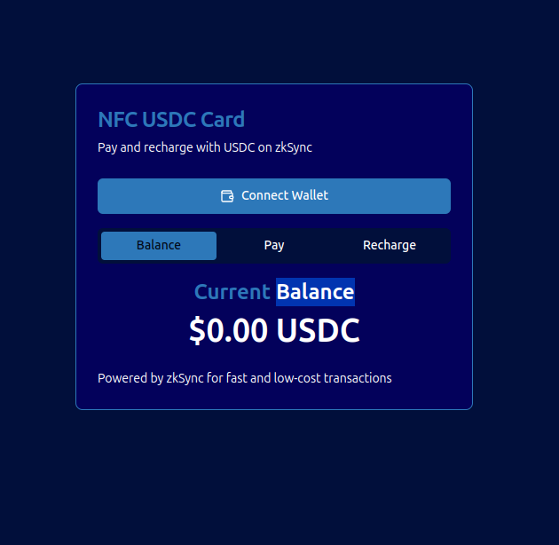
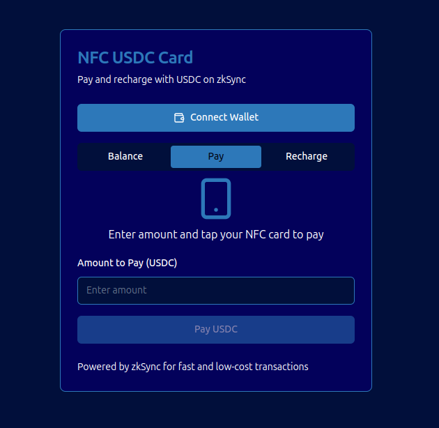

# ZKard: Rechargeable Anonymous Payment System

ZKard is an innovative payment system built on zkSync, enabling fast, permissionless, and anonymous payments. This monorepo contains both the card emissor and the frontend code for the checkout process.

## Project Overview

ZKard leverages blockchain technology to provide a seamless and secure payment experience:

- Each ntag424 card is uncloneable and its signature can be verified by the emissor.
- Cards are associated with Abstract Accounts that can be "recharged".
- The emissor owns these accounts and can make payments from them when verified by the card signature.
- Gas fees are handled by a General Paymaster that maintains a list of addresses it pays for (the addresses associated with the cards).

The result is a transparent experience for the end user: Tap to pay, fast and secure.






## Monorepo Structure

This project uses Turborepo to manage the monorepo structure. The main packages are:

- `apps/card`: Card emissor functionality
- `apps/checkout`: Frontend code for the checkout process

## Contract

- [Contracts Repository](https://github.com/zkard-org/contracts)

## Prerequisites

- Node.js (v14 or later)
- pnpm (v6 or later)
- MetaMask or another Ethereum wallet

## Installation

1. Clone the repository:
   ```
   git clone https://github.com/your-username/zkard.git
   cd zkard
   ```

2. Install dependencies:
   ```
   pnpm install
   ```

3. Create a `.env` file in the root directory and add your environment variables:
   ```
   NEXT_PUBLIC_DEFAULT_CHAIN=zkSync_era
   ```

## Running the Applications

To start all applications in development mode:

```
pnpm run dev
```

To run a specific app:

```
pnpm run dev --filter=emissor
# or
pnpm run dev --filter=checkout
```

The apps will be available at:
- Card: [http://localhost:3000](http://localhost:3000)
- Checkout: [http://localhost:3001](http://localhost:3001)

## Building the Project

To build all packages and apps:

```
pnpm run build
```

## Features

- Rechargeable ZKard system
- Card emissor functionality
- Checkout frontend
- Integration with zkSync and ethers.js
- Next.js-based web applications
- Wallet connection (MetaMask, etc.)
- Network switching (zkSync Era, zkSync Sepolia Testnet, zkSync Goerli Testnet)
- Account information and balance display
- Smart contract interactions (read/write)
- Transaction sending
- Message and typed data signing
- Contract event and pending transaction monitoring
- ERC20 token interactions


## Contributing

Contributions are welcome! Please feel free to submit a Pull Request.

## License

This project is licensed under the MIT License.

## Acknowledgements

- [zkSync](https://zksync.io/)
- [ethers.js](https://docs.ethers.io/)
- [Next.js](https://nextjs.org/)
- [Turborepo](https://turbo.build/repo)
